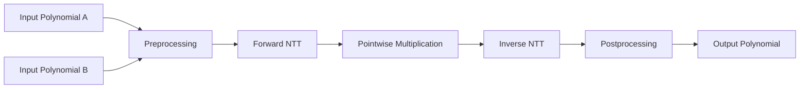

# fermat-conv-hardware

Hardware implementation of an accelerator for **Fermat modulus convolution** targeting high-performance polynomial multiplication for **Post-Quantum Cryptography (PQC)** and **Fully Homomorphic Encryption (FHE)**.

---

# Step 1: Python Reference Model

Before implementing the hardware, we first develop a cycle-independent Python model. This serves as the functional golden reference for the RTL implementation.

## Goals

* Simulate polynomial multiplication over the Fermat modulus.
* Match the computation flow intended for hardware.
* Keep the implementation modular and object-oriented.
* Reuse the same hierarchy in the RTL design.

---

## Fermat Modulus Parameters

| Parameter | Value |
|-----------|-------|
| Modulus | **65537 = 2¹⁶ + 1** |
| Polynomial Size | Configurable (up to 8192) |
| Primitive Generator | **3** |
| Maximum Direct Power-of-Two NTT | 32 |
| Larger NTT Sizes | Constructed using Mixed-Radix / Radix-32 decomposition |

---

## Overall Flow



---

## Software Architecture

The Python implementation mirrors the planned RTL hierarchy.

```text
Polynomial Multiplier
│
├── Polynomial
├── Preprocessor
├── NTT / INTT
│   ├── Stage
│   │   ├── Butterfly
│   │   └── Twiddle Memory
│   └── Radix Decomposition
├── Postprocessor
└── Modular Arithmetic
```

---

## Planned Components

| Component | Purpose |
|----------|---------|
| Polynomial | Stores polynomial coefficients |
| Twiddle Generator | Generates all NTT and preprocessing twiddle tables |
| Modular Arithmetic | Fast Fermat modular arithmetic |
| Butterfly | Performs one radix-2 butterfly |
| Stage | Executes all butterflies within one stage |
| NTT | Forward transform |
| INTT | Inverse transform |
| Preprocessor | Performs negacyclic preprocessing |
| Postprocessor | Performs inverse preprocessing |

---

## Butterfly Operation

Each butterfly receives

* Coefficient **A**
* Coefficient **B**
* Twiddle Factor **W**

and computes

```text
A' = A + B × W
B' = A - B × W
```

All arithmetic is performed modulo **65537**.

---

## Twiddle Factor Generation

The multiplicative group of

```text
F65537
```

contains **65536** non-zero elements.

The primitive generator

```text
g = 3
```

generates every non-zero element exactly once.

A primitive N-th root of unity is computed as

```text
ωN = g^((65536)/N)
```

The Python model generates four twiddle tables:

| Table | Purpose |
|-------|---------|
| Forward NTT | Butterfly twiddles |
| Inverse NTT | INTT butterflies |
| Preprocessing | ω₂Nⁱ |
| Postprocessing | ω₂N⁻ⁱ |

---

## Power-of-Two Twiddle Optimization

The Fermat modulus satisfies

```text
2¹⁶ ≡ -1 (mod 65537)
```

which implies

```text
2³² ≡ 1 (mod 65537)
```

Therefore, **2 is a primitive 32nd root of unity**.

This allows every multiplication by

```text
1
2
4
8
...
2³¹
```

to be implemented using cyclic shifts instead of modular multipliers.

For transforms larger than 32 points, Mixed-Radix decomposition is used. The internal 32-point sub-NTTs use shift-based twiddles, while the merge stages require general twiddle factors generated from the primitive generator.

---

## Fermat Modular Reduction

Instead of using expensive integer division,

```text
x mod (2¹⁶ + 1)
```

is computed using

```text
x = xlow + 2¹⁶ xhigh

↓

x mod 65537

=

xlow - xhigh
```

followed by a small correction if necessary.

This reduction is used throughout the simulator and directly maps to the intended hardware implementation.

---

## Negacyclic Preprocessing

The polynomial multiplication target ring is

```text
Zq[x] / (xᴺ + 1)
```

A standard NTT naturally computes multiplication over

```text
Zq[x] / (xᴺ - 1)
```

Therefore, preprocessing multiplies coefficient *i* by

```text
ω₂Nⁱ
```

before the Forward NTT.

After the INTT, postprocessing multiplies coefficient *i* by

```text
ω₂N⁻ⁱ
```

to recover the correct negacyclic convolution.

---

## Hardware Considerations Reflected in Python

Although the Python model is functional rather than cycle-accurate, it mirrors the intended RTL architecture.

* Object-oriented hierarchy matching RTL modules
* Stage-wise execution
* Explicit butterfly objects
* Configurable transform sizes
* Mixed-radix decomposition
* Twiddle memory abstraction
* Fermat modular reduction
* Power-of-two shift optimization

---

## Current Progress

- [x] Polynomial class
- [x] Fermat modular arithmetic
- [ ] Twiddle generation
- [ ] Preprocessor
- [ ] Butterfly
- [ ] Stage
- [ ] Forward NTT
- [ ] Pointwise multiplication
- [ ] Inverse NTT
- [ ] Postprocessor
- [ ] Polynomial multiplication
- [ ] Verification against naive multiplication
- [ ] Hardware RTL implementation
