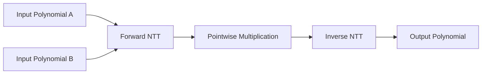

# fermat-conv-hardware

Hardware implementation of an accelerator for **Fermat modulus convolution** targeting high-performance polynomial multiplication for **Post-Quantum Cryptography (PQC)** and **Fully Homomorphic Encryption (FHE)**.

---

# Step 1: Python Reference Model

Before implementing the hardware, we first develop a cycle-independent Python model. This serves as the functional golden reference for the RTL implementation.

## Goals

* Simulate polynomial multiplication over the Fermat modulus.
* Match the computation flow intended for hardware.
* Keep the implementation modular and object-oriented.
* Reuse the same hierarchy in the RTL design.

---

## Fermat Modulus Parameters

| Parameter                       | Value                                         |
| ------------------------------- | --------------------------------------------- |
| Modulus                         | **65537 = 2¹⁶ + 1**                           |
| Polynomial Size                 | Configurable (up to 8192)                     |
| Maximum Direct Power-of-Two NTT | 32                                            |
| Larger NTT Sizes                | Constructed using Radix-32/16/8 decomposition |

---

## Overall Flow



---

## Software Architecture

The Python implementation follows the same hierarchy planned for hardware.

```text
Polynomial Multiplier
│
├── NTT / INTT
│   ├── Stage
│   │   ├── Radix
│   │   │   └── Butterfly
│   │   │
│   │   └── Twiddle Factors
│   │
│   └── Preprocessing
│
└── Modular Arithmetic
```

---

## Planned Components

| Component          | Purpose                                       |
| ------------------ | --------------------------------------------- |
| Polynomial         | Stores polynomial coefficients                |
| TwiddleGenerator   | Generates or loads twiddle factors            |
| Butterfly          | Performs a single butterfly operation         |
| Stage              | Executes all butterflies within one NTT stage |
| NTT                | Forward Number Theoretic Transform            |
| INTT               | Inverse Number Theoretic Transform            |
| Modular Arithmetic | Fermat modulus reduction and multiplication   |

---

## Butterfly Operation

Each butterfly receives:

* Coefficient **A**
* Coefficient **B**
* Twiddle factor **W**

and computes

```text
A' = A + B × W
B' = A - B × W
```

All operations are performed modulo **65537**.

---

## Twiddle Factor Strategy

Two types of twiddle factors exist.

| Type                  | Hardware Implementation            |
| --------------------- | ---------------------------------- |
| Power-of-two twiddles | Computed dynamically using shifts  |
| General twiddles      | Precomputed and loaded from memory |

To keep the Python model faithful to the hardware implementation, non-power-of-two twiddle factors will also be loaded from files instead of being generated during execution.

---

## Preprocessing

Before the transform begins:

* Generate polynomial coefficients
* Generate or load twiddle factors
* Arrange twiddle factors in hardware-friendly order (bit-reversed if required)

---

## Hardware Considerations Reflected in Python

Although the Python model is functional rather than cycle-accurate, it mirrors the intended hardware architecture.

* Modular object hierarchy
* Separate butterfly units
* Stage-by-stage execution
* Configurable polynomial sizes
* Support for radix decomposition
* Twiddle memory abstraction

This allows the software model to act as a direct reference while developing the RTL implementation.

---

## Roadmap

* [ ] Fermat modular arithmetic
* [ ] Polynomial class
* [ ] Twiddle factor generation
* [ ] Butterfly implementation
* [ ] Stage implementation
* [ ] Forward NTT
* [ ] Inverse NTT
* [ ] Polynomial multiplication
* [ ] Verification against naive multiplication
* [ ] Hardware-oriented optimizations
