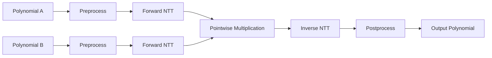

# fermat-conv-hardware

Hardware implementation of a **Fermat Modulus Convolution Accelerator** for high-performance polynomial multiplication targeting **Post-Quantum Cryptography (PQC)** and **Fully Homomorphic Encryption (FHE)**.

The project begins with a Python reference model that serves as the functional golden model for the eventual RTL implementation.

---

# Overview

Polynomial multiplication is the computational bottleneck in many lattice-based cryptographic schemes such as ML-KEM (Kyber), HAWK, and several FHE schemes.

This project implements a hardware-friendly polynomial multiplication pipeline over the Fermat modulus

```
q = 65537 = 2¹⁶ + 1
```

whose special arithmetic properties allow modular reduction using only bit operations and additions/subtractions.

---

# Current Pipeline



---

# Software Architecture

The software mirrors the intended RTL hierarchy.

```text
Polynomial Multiplier
│
├── Polynomial
│
├── Twiddle Generator
│
├── NTT
│   ├── Stage
│   │   └── Radix-2 Butterfly
│   └── Twiddle Memory
│
├── Pointwise Multiplier
│
├── Inverse NTT
│
└── Modular Arithmetic
```

Every software component is intended to directly map to a future RTL module.

---

# Implemented Modules

| Module | Status |
|---------|:------:|
| Polynomial | ✅ |
| Modular Arithmetic | ✅ |
| Radix-2 Butterfly | ✅ |
| Stage Scheduler | ✅ |
| Twiddle Generator | ✅ |
| Twiddle Memory | ✅ |
| Forward NTT | ✅ |
| Inverse NTT | ✅ |
| Polynomial Multiplication Pipeline | ✅ |
| Naive Golden Reference | ✅ |

---

# Fermat Modulus

The modulus used throughout the project is

```
65537 = 2¹⁶ + 1
```

which satisfies

```
2¹⁶ ≡ -1 (mod 65537)

2³² ≡ 1 (mod 65537)
```

This enables efficient modular reduction.

Instead of

```
x % 65537
```

the reduction is performed as

```
x = x_low + 2¹⁶ x_high

↓

x mod 65537

=

x_low - x_high
```

followed by a small correction if necessary.

No integer division is required.

---

# Twiddle Factors

Twiddle factors are generated using the primitive generator

```
g = 3
```

where

```
ωN = g^((65536)/N)
```

The software currently generates

- Forward NTT twiddles
- Inverse NTT twiddles
- Preprocessing twiddles
- Postprocessing twiddles

and stores them in stage-wise twiddle memories.

---

# Current NTT Architecture

The current implementation is a standard **radix-2 Cooley-Tukey NTT**.

```
NTT

↓

Stage 0

↓

Stage 1

↓

Stage 2

↓

...

↓

Stage log₂(N)-1
```

Each stage consists entirely of radix-2 butterflies.

---

# Power-of-Two Optimization

The Fermat modulus provides a unique optimization.

Since

```
2³² ≡ 1 (mod 65537)
```

multiplication by

```
1
2
4
8
...
2³¹
```

can be replaced by cyclic shifts instead of modular multiplication.

This optimization is currently being integrated into the butterfly datapath.

---

# Negacyclic Convolution

The accelerator computes multiplication over

```
Zq[x] / (xᴺ + 1)
```

using

- preprocessing
- forward NTT
- pointwise multiplication
- inverse NTT
- postprocessing

The Python implementation includes a naive schoolbook multiplier with negacyclic reduction, which acts as the golden reference for validating the NTT pipeline.

---

# Verification

The project includes two independent implementations.

### NTT Pipeline

```
Polynomial

↓

Preprocess

↓

Forward NTT

↓

Pointwise Multiply

↓

Inverse NTT

↓

Postprocess
```

### Golden Reference

```
Polynomial

↓

Schoolbook O(N²) Multiplication

↓

Negacyclic Reduction
```

Both outputs are compared coefficient-by-coefficient to verify correctness.

---

# Repository Structure

```
software/
│
├── butterfly.py
├── modular_arithmetic.py
├── ntt.py
├── polynomial.py
├── polynomial_multiplier.py
├── stage.py
└── twiddle.py

tests/
│
└── pipeline_test.py
```

---

# Current Status

- ✅ Fermat modular arithmetic
- ✅ Radix-2 butterfly implementation
- ✅ Stage execution engine
- ✅ Twiddle generation
- ✅ Twiddle memory abstraction
- ✅ Forward NTT
- ✅ Inverse NTT
- ✅ Complete polynomial multiplication pipeline
- ✅ Naive golden reference
- ✅ Pipeline verification framework

---

# Future Work

- [ ] Power-of-two shift-based butterfly optimization
- [ ] Radix-32 fused stage implementation
- [ ] Mixed-radix decomposition
- [ ] Bit-reversed twiddle storage
- [ ] Cycle-accurate hardware simulator
- [ ] RTL implementation (SystemVerilog)
- [ ] FPGA validation
- [ ] ASIC implementation
